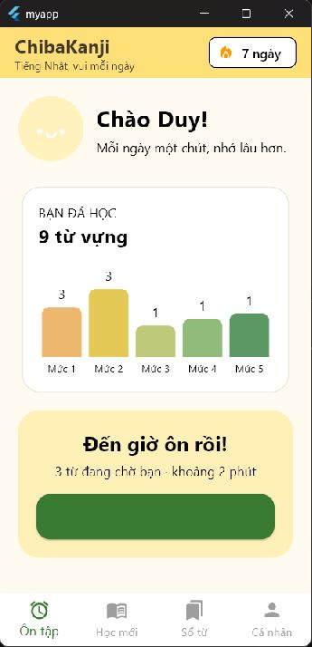

# ChibaKanji 🇯🇵

> Ứng dụng Flutter hỗ trợ học từ vựng và Kanji tiếng Nhật theo từng phiên ngắn mỗi ngày.

<p align="center">
  
</p>

## Giới thiệu

ChibaKanji là đồ án ứng dụng di động đang ở giai đoạn phát triển ban đầu. Dự án hướng đến trải nghiệm học đơn giản, trực quan và giúp người học duy trì thói quen ôn tập hằng ngày.

## Tiến độ hiện tại

- [x] Khởi tạo dự án Flutter và cấu trúc thư mục
- [x] Xây dựng các model `User`, `Vocabulary` và `Progress`
- [x] Thiết kế giao diện trang chủ và thanh điều hướng 4 mục
- [x] Mô phỏng tiến độ ghi nhớ theo 5 mức
- [ ] Hoàn thiện bài học, flashcard và quiz
- [ ] Kết nối dữ liệu cục bộ và thông báo nhắc học

## Công nghệ

- **Flutter** và **Dart**
- **Material Design**
- Dự kiến sử dụng **Provider** để quản lý trạng thái và **SQLite/Hive** để lưu dữ liệu

## Chạy dự án

```bash
git clone https://github.com/Pham-Duyy/Nhom_App_LearnJPVocab.git
cd Nhom_App_LearnJPVocab
flutter pub get
flutter run
```

## Định hướng phát triển

Luồng học chính gồm: **học từ mới → flashcard → ôn tập theo mức ghi nhớ → quiz → theo dõi tiến độ**.

---

Đồ án môn Lập trình thiết bị di động — Phenikaa University.
