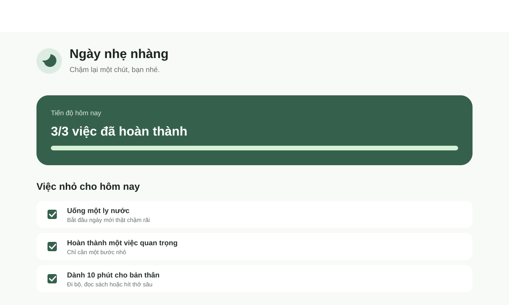

# Ngày nhẹ nhàng

> Một ứng dụng Flutter nhỏ giúp bạn bắt đầu ngày mới chậm rãi hơn — tập trung vào vài việc đơn giản, dễ hoàn thành và đáng trân trọng.

<p align="center">
  
</p>

<p align="center">
  
  
  
  
</p>

## Giới thiệu

**Ngày nhẹ nhàng** là một demo Flutter tối giản, được xây dựng với tinh thần: không cần làm quá nhiều, chỉ cần hoàn thành những điều nhỏ nhưng có ý nghĩa. Ứng dụng phù hợp để minh hoạ cách xây dựng giao diện Flutter hiện đại, có trạng thái tương tác và hoạt động tốt trên web lẫn Windows.

## Điểm nổi bật

- Giao diện Material 3 với bảng màu xanh dịu, tối giản và dễ đọc.
- Danh sách việc cần làm có thể đánh dấu hoàn thành.
- Thanh tiến độ cập nhật ngay khi trạng thái công việc thay đổi.
- Thông điệp động khích lệ người dùng theo tiến độ trong ngày.
- Không dùng package ngoài — thuận tiện để học và mở rộng.

## Công nghệ

| Thành phần | Sử dụng |
| --- | --- |
| Framework | Flutter |
| Ngôn ngữ | Dart |
| UI | Material 3 |
| Nền tảng hỗ trợ | Web, Windows |

## Bắt đầu nhanh

### Yêu cầu

- Flutter SDK đã được thêm vào biến môi trường `PATH`.
- Một trình duyệt Edge hoặc Chrome để chạy bản web; hoặc Visual Studio để chạy bản Windows.

Kiểm tra môi trường:

```powershell
flutter doctor
```

### Chạy dự án

```powershell
git clone <repository-url>
cd myapp
flutter pub get
```

Chạy trên Microsoft Edge:

```powershell
flutter run -d edge
```

Hoặc chạy web server tại cổng `8080`:

```powershell
flutter run -d web-server --web-hostname 0.0.0.0 --web-port 8080
```

Sau đó mở [http://localhost:8080](http://localhost:8080) trong trình duyệt.

Chạy ứng dụng Windows:

```powershell
flutter run -d windows
```

## Cấu trúc dự án

```text
myapp/
├── assets/
│   └── images/
│       └── calm-day-preview.svg   # Ảnh xem trước trong README
├── lib/
│   └── main.dart                  # Giao diện và trạng thái ứng dụng
├── test/
├── pubspec.yaml
└── README.md
```

## Khám phá giao diện

Mở `lib/main.dart` để xem các phần chính:

- `CalmDayApp`: cấu hình ứng dụng, giao diện Material 3 và bảng màu.
- `HomePage`: màn hình chính có trạng thái.
- `_Task`: mô hình dữ liệu đơn giản cho mỗi việc cần làm.

Khi ứng dụng đang chạy, lưu file hoặc nhấn `r` trong terminal để **hot reload** và xem thay đổi ngay lập tức.

## Hướng phát triển

- Lưu công việc bằng `shared_preferences` hoặc Firebase.
- Thêm lịch theo ngày và nhắc nhở nhẹ nhàng.
- Hỗ trợ giao diện tối (dark mode).
- Cho phép người dùng thêm, sửa và xoá việc cần làm.

---

Được xây dựng bằng Flutter với một lời nhắc nhỏ: *một ngày tốt đẹp có thể bắt đầu từ một việc rất nhỏ.*
