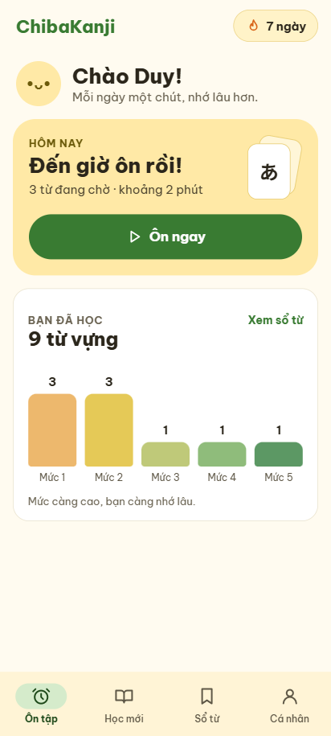
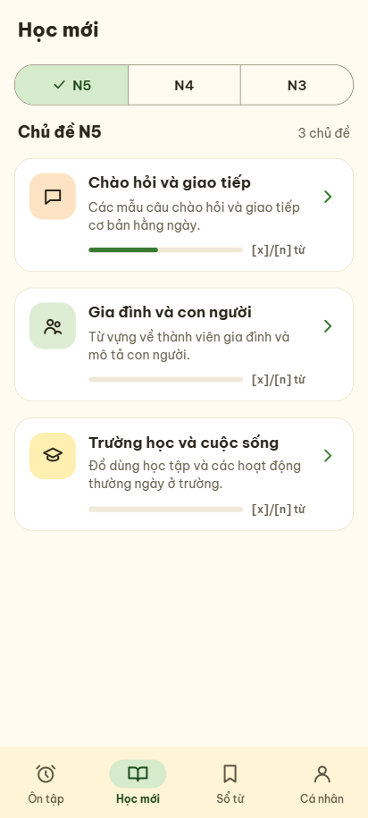
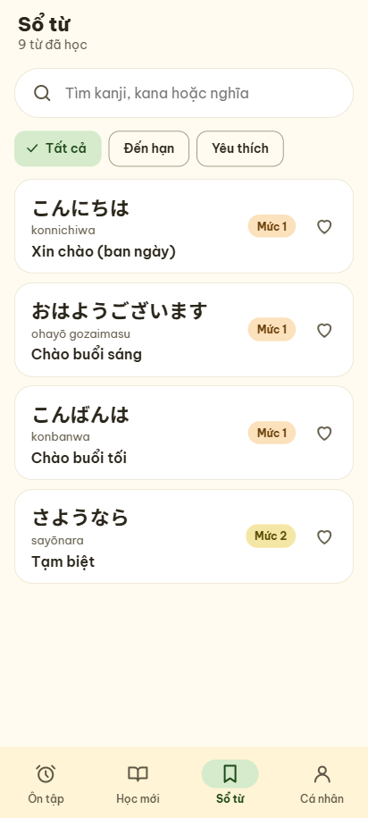
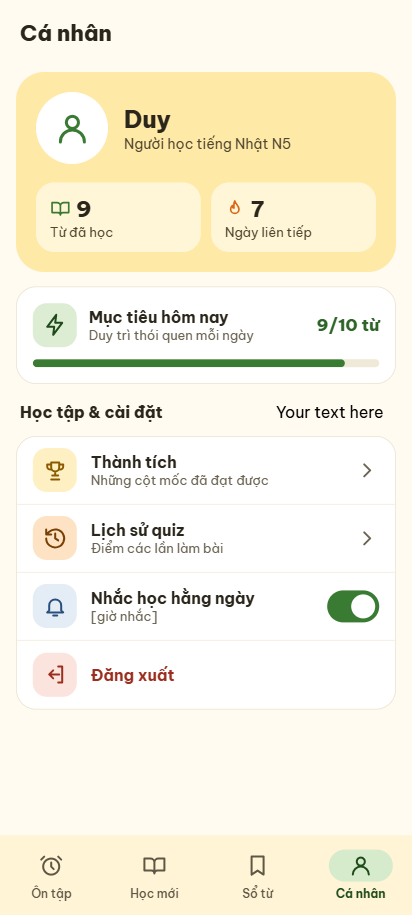
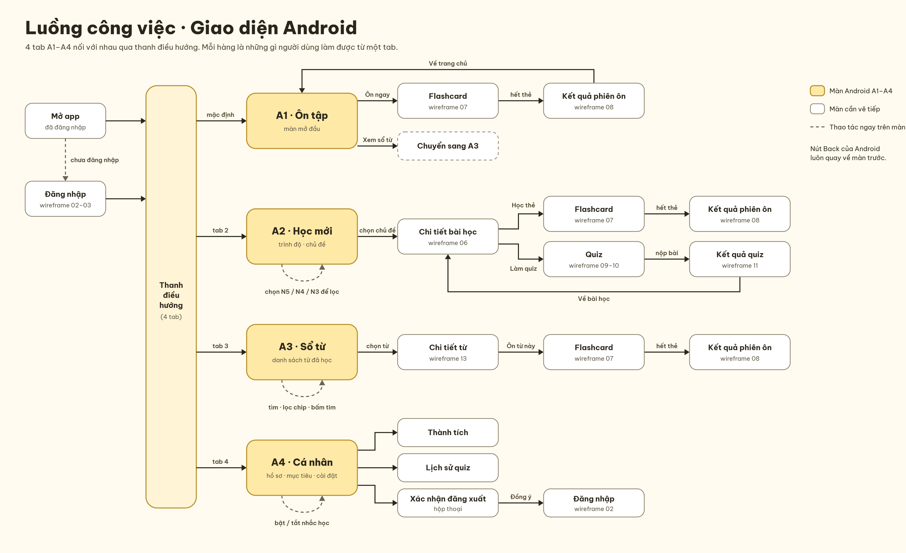

# ChibaKanji 🇯🇵

Ứng dụng Flutter hỗ trợ học và ôn tập từ vựng tiếng Nhật theo từng phiên ngắn mỗi ngày.

## Giao diện ứng dụng

Ứng dụng gồm 4 màn hình chính, được kết nối bằng Bottom Navigation Bar.

| A1 · Ôn tập | A2 · Học mới |
|---|---|
|  |  |

| A3 · Sổ từ | A4 · Cá nhân |
|---|---|
|  |  |

## Chức năng chính

- **Ôn tập:** xem số từ đến hạn, thống kê 5 mức ghi nhớ và bắt đầu phiên ôn.
- **Học mới:** chọn chủ đề, bài học và học từ bằng flashcard.
- **Sổ từ:** tìm kiếm, lọc, xem chi tiết và đánh dấu từ yêu thích.
- **Cá nhân:** xem số từ đã học, chuỗi ngày học và mục tiêu mỗi ngày.
- **Flashcard:** lật thẻ, đánh dấu đã nhớ hoặc chưa nhớ và xem kết quả phiên học.

## Luồng công việc

<p align="center">
  
</p>

Luồng sử dụng chính:

1. Người dùng mở ứng dụng và đi đến màn hình **Ôn tập**.
2. Bottom Navigation Bar cho phép chuyển giữa **Ôn tập**, **Học mới**, **Sổ từ** và **Cá nhân**.
3. Từ **Ôn tập**, người dùng mở flashcard ôn tập và xem kết quả sau khi hoàn thành.
4. Từ **Học mới**, người dùng chọn chủ đề, chọn bài học rồi bắt đầu flashcard.
5. Từ **Sổ từ**, người dùng tìm kiếm, lọc và xem chi tiết những từ đã học.
6. Từ **Cá nhân**, người dùng theo dõi mục tiêu, thành tích và thiết lập nhắc học.

## Cấu trúc màn hình

| Màn hình | File chính |
|---|---|
| Bottom Navigation Bar | [`lib/screens/main_screen.dart`](lib/screens/main_screen.dart) |
| Ôn tập | [`lib/screens/home/review_home_page.dart`](lib/screens/home/review_home_page.dart) |
| Học mới | [`lib/screens/lesson/category_screen.dart`](lib/screens/lesson/category_screen.dart) |
| Danh sách bài học | [`lib/screens/lesson/lesson_screen.dart`](lib/screens/lesson/lesson_screen.dart) |
| Flashcard | [`lib/screens/flashcard/flashcard_screen.dart`](lib/screens/flashcard/flashcard_screen.dart) |
| Kết quả học | [`lib/screens/flashcard/learning_result_screen.dart`](lib/screens/flashcard/learning_result_screen.dart) |
| Sổ từ | [`lib/screens/vocabulary/vocabulary_book_screen.dart`](lib/screens/vocabulary/vocabulary_book_screen.dart) |
| Cá nhân | [`lib/screens/profile/profile_screen.dart`](lib/screens/profile/profile_screen.dart) |

## Phân công nhóm

| Thành viên | Công việc |
|---|---|
| Phạm Khương Duy | Kiến trúc dữ liệu, Provider, Ôn tập, Học mới, Flashcard, Sổ từ và Cá nhân |
| `truongsonnguyen17` | Hỗ trợ phát triển và tích hợp mã nguồn trên repository chung |

> Nhóm cập nhật họ tên đầy đủ và mã số sinh viên của từng thành viên trước khi nộp bài.

## Một số commit chính

| Nội dung | Commit |
|---|---|
| Màn hình chọn chủ đề và bài học | [`83fb1f2`](https://github.com/Pham-Duyy/Nhom_App_LearnJPVocab/commit/83fb1f2) |
| Flashcard và kết quả học | [`017b32b`](https://github.com/Pham-Duyy/Nhom_App_LearnJPVocab/commit/017b32b) |
| Điều hướng và chống gửi đáp án hai lần | [`e4bea01`](https://github.com/Pham-Duyy/Nhom_App_LearnJPVocab/commit/e4bea01) |
| Thống kê và luồng ôn tập | [`c0838ec`](https://github.com/Pham-Duyy/Nhom_App_LearnJPVocab/commit/c0838ec) |
| Lớp trừu tượng xác thực | [`dbabb80`](https://github.com/Pham-Duyy/Nhom_App_LearnJPVocab/commit/dbabb80) |

Commit cho giao diện **Sổ từ**, **Cá nhân** và tài liệu này sẽ được bổ sung sau khi thay đổi được commit và push lên GitHub.

## Công nghệ

- Flutter và Dart
- Material Design
- Provider để quản lý trạng thái
- Repository pattern và dữ liệu mock
- Flutter Test

## Chạy dự án

```bash
git clone https://github.com/Pham-Duyy/Nhom_App_LearnJPVocab.git
cd Nhom_App_LearnJPVocab
flutter pub get
flutter run -d edge
```

Chạy kiểm tra trước khi commit:

```bash
flutter analyze
flutter test
```

## Trạng thái

- [x] Bottom Navigation Bar với 4 mục
- [x] Giao diện Ôn tập
- [x] Giao diện Học mới và danh sách bài học
- [x] Flashcard và kết quả phiên học
- [x] Giao diện Sổ từ
- [x] Giao diện Cá nhân
- [x] Thiết kế và sơ đồ luồng công việc
- [ ] Firebase Authentication và Cloud Firestore
- [ ] Quiz và kết quả quiz
- [ ] Thông báo nhắc học

---

Đồ án môn Lập trình thiết bị di động — Phenikaa University.
